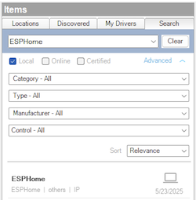

------------------------------------------------------------------------

# Overview

> DISCLAIMER: This software is neither affiliated with nor endorsed by
> either Control4 or ESPHome.

Integrate ESPHome-based devices into Control4. ESPHome is an open-source
system that transforms common microcontrollers, like ESP8266 and ESP32,
into smart home devices through simple YAML configuration. ESPHome
devices can be set up, monitored, and controlled using a web browser,
Home Assistant, or other compatible platforms. This driver enables
seamless monitoring and control of ESPHome devices directly from your
Control4 system.

# Index

- [System Requirements](#system-requirements)
- [Features](#features)
- [Compatibility](#compatibility)
  - [Verified Devices](#verified-devices)
  - [Supported ESPHome Entities](#supported-esphome-entities)
- [Installer Setup](#installer-setup)
  - [Driver Installation](#driver-installation)
  - [Driver Setup](#driver-setup)
    - [Driver Properties](#driver-properties)
      - [Cloud Settings](#cloud-settings)
      - [Driver Settings](#driver-settings)
      - [Device Settings](#device-settings)
      - [Device Info](#device-info)
    - [Driver Actions](#driver-actions)
- [Support](#support)
- [Changelog](#changelog)

# System requirements

- Control4 OS 3.3+

# Features

- Local network communication requiring no cloud services
- Real-time updates from all [supported
  entities](#supported-esphome-entities) exposed by the device
- Variable Programming Support

# Compatibility

## Verified Devices

This driver will generically work with any ESPHome device, but we have
tested extensively with the following devices:

- [ratgdo](https://ratcloud.llc)

If you try this driver on a product listed above, and it works, let us
know!

## Supported ESPHome Entities

| Entity Type         | Supported |
|---------------------|-----------|
| Alarm Control Panel | ❌        |
| API Noise           | ❌        |
| Binary Sensor       | ✅        |
| Bluetooth Proxy     | ❌        |
| Button              | ✅        |
| Climate             | ❌        |
| Cover               | ✅        |
| Datetime            | ❌        |
| Date                | ❌        |
| Time                | ❌        |
| Camera              | ❌        |
| Event               | ❌        |
| Fan                 | ❌        |
| Light               | ✅        |
| Lock                | ✅        |
| Media Player        | ❌        |
| Number              | ✅        |
| Select              | ❌        |
| Sensor              | ✅        |
| Siren               | ❌        |
| Switch              | ✅        |
| Text                | ✅        |
| Text Sensor         | ✅        |
| Update              | ❌        |
| Valve               | ❌        |
| Voice Assistant     | ❌        |

# Installer Setup

> ⚠️ Only a ***single*** driver instance is required per ESPHome device.
> Multiple instance of this driver connected to the same device will
> have unexpected behavior. However, you can have multiple instances of
> this driver connected to ***different*** ESPHome devices.

## Driver Installation

Driver installation and setup are similar to most other ip-based
drivers. Below is an outline of the basic steps for your convenience.

1.  Download the latest `control4-esphome.zip` from
    [Github](https://github.com/finitelabs/control4-esphome/releases/latest).

2.  Extract and
    [install]((https://www.control4.com/help/c4/software/cpro/dealer-composer-help/content/composerpro_userguide/adding_drivers_manually.htm))
    the `esphome.c4z`, `esphome_light.c4z`, and `esphome_lock.c4z`
    drivers.

3.  Use the "Search" tab to find the "ESPHome" driver and add it to your
    project.

    > ⚠️ A ***single*** driver instance is required per ESPHome device.

    

4.  Configure the [Device Settings](#device-settings) with the
    connection information.

5.  After a few moments the [`Driver Status`](#driver-status-read-only)
    will display `Connected`. If the driver fails to connect, set the
    [`Log Mode`](#log-mode--off--print--log--print-and-log-) property to
    `Print` and re-set the [`IP Adress`](#ip-address) field to
    reconnect. Then check the lua output window for more information.

6.  Once connected, the driver will automatically create variables and
    connections for each supported entity type.

7.  To control lights and/or locks, use the "Search" tab to find the
    "ESPHome Light" and/or "ESPHome Lock" driver. Add one driver
    instance for each exposed light or lock entity in your project. In
    the "Connections" tab, select the "ESPHome" driver and bind the
    light or lock entities to the newly added drivers.

## Driver Setup

### Driver Properties

#### Cloud Settings

##### Automatic Updates

Turns on/off the GitHub cloud automatic updates.

##### Update Channel

Sets the update channel for which releases are considered during an
automatic update from the GitHub repo releases.

#### Driver Settings

##### Driver Status (read-only)

Displays the current status of the driver.

##### Driver Version (read-only)

Displays the current version of the driver.

##### Log Level \[ Fatal \| Error \| Warning \| ***Info*** \| Debug \| Trace \| Ultra \]

Sets the logging level. Default is `Info`.

##### Log Mode \[ ***Off*** \| Print \| Log \| Print and Log \]

Sets the logging mode. Default is `Off`.

#### Device Settings

##### IP Address

Sets the device IP address (e.g. `192.168.1.30`). Domain names are
allowed as long as they can be resolved to an accessible IP address by
the controller. HTTPS is not supported.

> ⚠️ If you are using an IP address, you should ensure it will not
> change by assigning a static IP or creating a DHCP reservation.

##### Port

Sets the device port. The default port for ESPHome devices is `6053`.

##### Password

Sets the device password. If the device does not have a password, leave
this field blank.

#### Device Info

##### Name (read-only)

Displays the name of the connected ESPHome device.

##### Model (read-only)

Displays the model of the connected ESPHome device.

##### Manufacturer (read-only)

Displays the manufacturer of the connected ESPHome device.

##### MAC Address (read-only)

Displays the MAC address of the connected ESPHome device.

##### Firmware Version (read-only)

Displays the firmware version of the connected ESPHome device.

#### Driver Actions

##### Update Drivers

Trigger the driver to update from the latest release on GitHub,
regardless of the current version.

##### Reset Connections and Variables

> ⚠️ This will reset all connection bindings and delete any programming
> associated with the variables.

Reset the driver connections and variables. This is useful if you change
the connected ESPHome device or there are stale connections or
variables.

# Support

If you have any questions or issues integrating this driver with
Control4, you can file an issue on GitHub:

<https://github.com/finitelabs/control4-esphome/issues/new>

# Changelog

## v20250606 - 2025-06-06

### Added

- Initial Release
