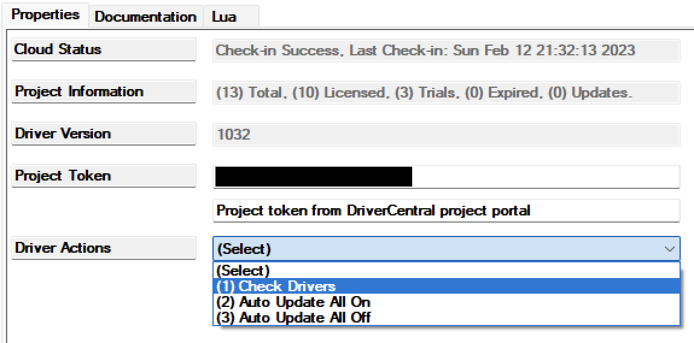
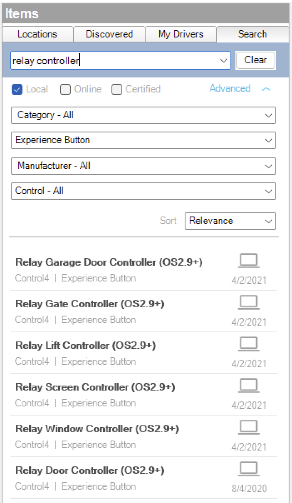
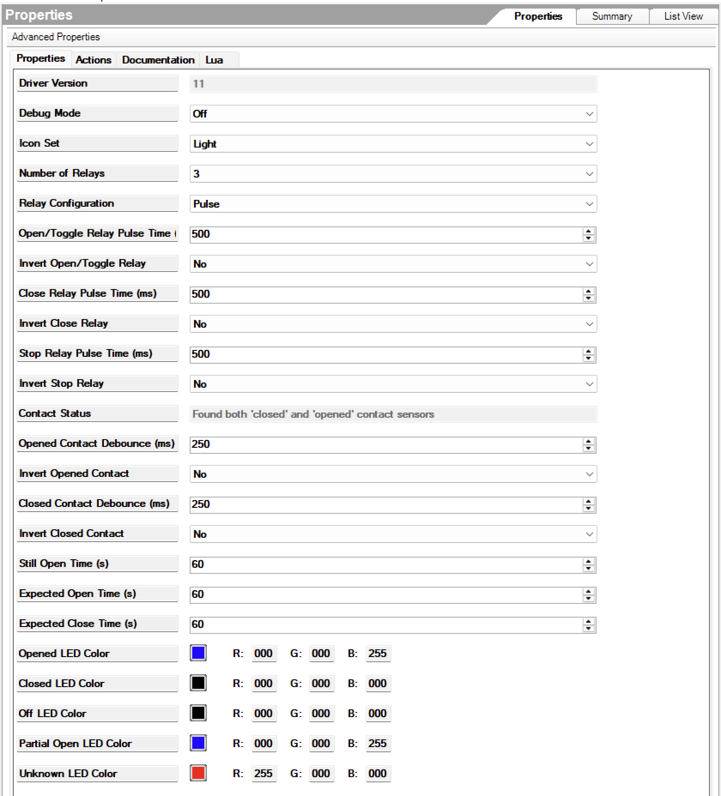
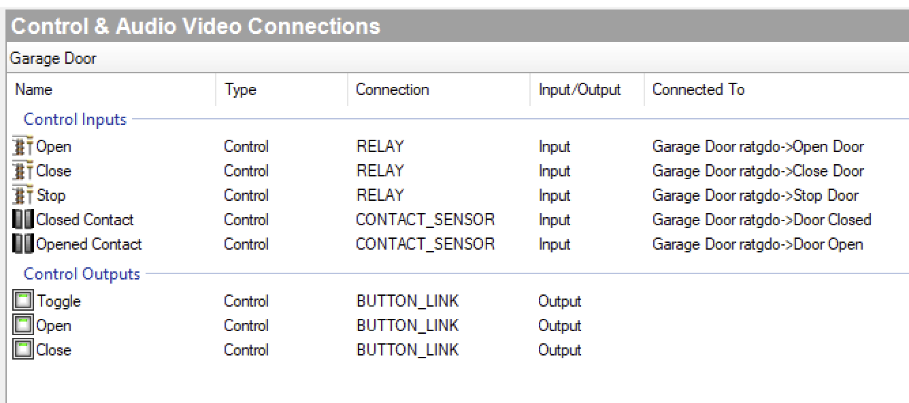

[copyright]: # "Copyright 2025 Finite Labs, LLC. All rights reserved."

---

# Overview

<!-- #ifndef DRIVERCENTRAL -->

> DISCLAIMER: This software is neither affiliated with nor endorsed by either
> Control4 or ESPHome.

<!-- #endif -->

Integrate ESPHome-based devices into Control4. ESPHome is an open-source system
that transforms common microcontrollers, like ESP8266 and ESP32, into smart home
devices through simple YAML configuration. ESPHome devices can be set up,
monitored, and controlled using a web browser, Home Assistant, or other
compatible platforms. This driver enables seamless monitoring and control of
ESPHome devices directly from your Control4 system.

# Index

- [System Requirements](#system-requirements)
- [Features](#features)
- [Compatibility](#compatibility)
  - [Verified Devices](#verified-devices)
  - [Supported ESPHome Entities](#supported-esphome-entities)
- [Installer Setup](#installer-setup)
  <!-- #ifdef DRIVERCENTRAL -->
  - [DriverCentral Cloud Setup](#drivercentral-cloud-setup)
  <!-- #endif -->
  - [Driver Installation](#driver-installation)
  - [Driver Setup](#driver-setup)
    - [Driver Properties](#driver-properties)
      - [Cloud Settings](#cloud-settings)
      - [Driver Settings](#driver-settings)
      - [Device Settings](#device-settings)
      - [Device Info](#device-info)
    - [Driver Actions](#driver-actions)
- [Configuration Guides](#configuration-guides)
  - [ratgdo Configuration Guide](#ratgdo-configuration-guide)
  <!-- #ifdef DRIVERCENTRAL -->
- [Developer Information](#developer-information)
<!-- #endif -->
- [Support](#support)
- [Changelog](#changelog)

# System requirements

- Control4 OS 3.3+

# Features

- Local network communication requiring no cloud services
- Real-time updates from all [supported entities](#supported-esphome-entities)
  exposed by the device
- Supports encrypted connections using the device encryption key
- Variable Programming Support

# Compatibility

## Verified Devices

This driver will generically work with any ESPHome device, but we have tested
extensively with the following devices:

- [ratgdo](https://ratcloud.llc) -
  [Configuration Guide](#ratgdo-configuration-guide)

If you try this driver on a product listed above, and it works, let us know!

## Supported ESPHome Entities

| Entity Type         | Supported |
| ------------------- | --------- |
| Alarm Control Panel | ❌        |
| API Noise           | ❌        |
| Binary Sensor       | ✅        |
| Bluetooth Proxy     | ❌        |
| Button              | ✅        |
| Climate             | ❌        |
| Cover               | ✅        |
| Datetime            | ❌        |
| Date                | ❌        |
| Time                | ❌        |
| Camera              | ❌        |
| Event               | ❌        |
| Fan                 | ❌        |
| Light               | ✅        |
| Lock                | ✅        |
| Media Player        | ❌        |
| Number              | ✅        |
| Select              | ❌        |
| Sensor              | ✅        |
| Siren               | ❌        |
| Switch              | ✅        |
| Text                | ✅        |
| Text Sensor         | ✅        |
| Update              | ❌        |
| Valve               | ❌        |
| Voice Assistant     | ❌        |

# Installer Setup

> ⚠️ Only a **_single_** driver instance is required per ESPHome device.
> Multiple instance of this driver connected to the same device will have
> unexpected behavior. However, you can have multiple instances of this driver
> connected to **_different_** ESPHome devices.

 <!-- #ifdef DRIVERCENTRAL -->

## DriverCentral Cloud Setup

> If you already have the
> [DriverCentral Cloud driver](https://drivercentral.io/platforms/control4-drivers/utility/drivercentral-cloud-driver/)
> installed in your project you can continue to
> [Driver Installation](#driver-installation).

This driver relies on the DriverCentral Cloud driver to manage licensing and
automatic updates. If you are new to using DriverCentral you can refer to their
[Cloud Driver](https://help.drivercentral.io/407519-Cloud-Driver) documentation
for setting it up.

<!-- #endif -->

## Driver Installation

Driver installation and setup are similar to most other ip-based drivers. Below
is an outline of the basic steps for your convenience.

<!-- #ifdef DRIVERCENTRAL -->

1. Download the latest `control4-esphome.zip` from
   [DriverCentral](https://drivercentral.io/platforms/control4-drivers/utility/esphome).
2. Extract and
   [install](<(https://www.control4.com/help/c4/software/cpro/dealer-composer-help/content/composerpro_userguide/adding_drivers_manually.htm)>)
   the `esphome.c4z`, `esphome_light.c4z`, and `esphome_lock.c4z` drivers.
3. Use the "Search" tab to find the "ESPHome" driver and add it to your project.

   > ⚠️ A **_single_** driver instance is required per ESPHome device.

   

4. Select the newly added driver in the "System Design" tab. You will notice
   that the `Cloud Status` reflects the license state. If you have purchased a
   license it will show `License Activated`, otherwise `Trial Running` and
   remaining trial duration.
5. You can refresh license status by selecting the "DriverCentral Cloud" driver
   in the "System Design" tab and perform the "Check Drivers" action.
    
6. Configure the [Device Settings](#device-settings) with the connection
   information.
7. After a few moments the [`Driver Status`](#driver-status-read-only) will
   display `Connected`. If the driver fails to connect, set the
   [`Log Mode`](#log-mode--off--print--log--print-and-log-) property to `Print`
   and re-set the [`IP Adress`](#ip-address) field to reconnect. Then check the
   lua output window for more information.
8. Once connected, the driver will automatically create variables and
   connections for each supported entity type.
9. To control lights and/or locks, use the "Search" tab to find the "ESPHome
   Light" and/or "ESPHome Lock" driver. Add one driver instance for each exposed
   light or lock entity in your project. In the "Connections" tab, select the
   "ESPHome" driver and bind the light or lock entities to the newly added
   drivers.

<!-- #else -->

1. Download the latest `control4-esphome.zip` from
   [Github](https://github.com/finitelabs/control4-esphome/releases/latest).
2. Extract and
   [install](<(https://www.control4.com/help/c4/software/cpro/dealer-composer-help/content/composerpro_userguide/adding_drivers_manually.htm)>)
   the `esphome.c4z`, `esphome_light.c4z`, and `esphome_lock.c4z` drivers.
3. Use the "Search" tab to find the "ESPHome" driver and add it to your project.

   > ⚠️ A **_single_** driver instance is required per ESPHome device.

   

4. Configure the [Device Settings](#device-settings) with the connection
   information.
5. After a few moments the [`Driver Status`](#driver-status-read-only) will
   display `Connected`. If the driver fails to connect, set the
   [`Log Mode`](#log-mode--off--print--log--print-and-log-) property to `Print`
   and re-set the [`IP Adress`](#ip-address) field to reconnect. Then check the
   lua output window for more information.
6. Once connected, the driver will automatically create variables and
   connections for each supported entity type.
7. To control lights and/or locks, use the "Search" tab to find the "ESPHome
   Light" and/or "ESPHome Lock" driver. Add one driver instance for each exposed
   light or lock entity in your project. In the "Connections" tab, select the
   "ESPHome" driver and bind the light or lock entities to the newly added
   drivers.

<!-- #endif -->

## Driver Setup

### Driver Properties

#### Cloud Settings

<!-- #ifdef DRIVERCENTRAL -->

##### Cloud Status

Displays the DriverCentral cloud license status.

<!-- #endif -->

##### Automatic Updates

<!-- #ifdef DRIVERCENTRAL -->

Turns on/off the DriverCentral cloud automatic updates.

<!-- #else -->

Turns on/off the GitHub cloud automatic updates.

##### Update Channel

Sets the update channel for which releases are considered during an automatic
update from the GitHub repo releases.

<!-- #endif -->

#### Driver Settings

##### Driver Status (read-only)

Displays the current status of the driver.

##### Driver Version (read-only)

Displays the current version of the driver.

##### Log Level [ Fatal | Error | Warning | **_Info_** | Debug | Trace | Ultra ]

Sets the logging level. Default is `Info`.

##### Log Mode [ **_Off_** | Print | Log | Print and Log ]

Sets the logging mode. Default is `Off`.

#### Device Settings

##### IP Address

Sets the device IP address (e.g. `192.168.1.30`). Domain names are allowed as
long as they can be resolved to an accessible IP address by the controller.
HTTPS is not supported.

> ⚠️ If you are using an IP address, you should ensure it will not change by
> assigning a static IP or creating a DHCP reservation.

##### Port

Sets the device port. The default port for ESPHome devices is `6053`.

##### Authentication Mode \[ **_None_** \| Password \| Encryption Key \]

Selects the authentication method for connecting to the ESPHome device.

- **None**: No authentication required.
- **Password**: Use a password for authentication (see below).
- **Encryption Key**: Use an encryption key for secure communication (see
  below).

##### Password

Shown only if
[Authentication Mode](#authentication-mode--none--password--encryption-key-) is
set to `Password`.  
Sets the device password. This must match the password configured on the ESPHome
device.

##### Encryption Key

Shown only if
[Authentication Mode](#authentication-mode--none--password--encryption-key-) is
set to `Encryption Key`.  
Sets the device encryption key for secure communication. This must match the
encryption key configured on the ESPHome device.

#### Device Info

##### Name (read-only)

Displays the name of the connected ESPHome device.

##### Model (read-only)

Displays the model of the connected ESPHome device.

##### Manufacturer (read-only)

Displays the manufacturer of the connected ESPHome device.

##### MAC Address (read-only)

Displays the MAC address of the connected ESPHome device.

##### Firmware Version (read-only)

Displays the firmware version of the connected ESPHome device.

#### Driver Actions

<!-- #ifndef DRIVERCENTRAL -->

##### Update Drivers

Trigger the driver to update from the latest release on GitHub, regardless of
the current version.

<!-- #endif -->

##### Reset Connections and Variables

> ⚠️ This will reset all connection bindings and delete any programming
> associated with the variables.

Reset the driver connections and variables. This is useful if you change the
connected ESPHome device or there are stale connections or variables.

# Configuration Guides

# ratgdo Configuration Guide

This guide provides instructions for configuring the ESPHome driver to work with
ratgdo devices for garage door control via relays in Control4 Composer Pro.

## Add Relay Controller Driver

Add the desired relay controller driver to your Control4 project in Composer
Pro.

## Relay Controller Properties

The ratgdo device exposes a "Cover" entity in ESPHome, which maps to the relay
controller functionality in Control4.

### Number of Relays

The ratgdo device uses a multi-relay configuration to control the garage door.
In Composer Pro, you should configure the relay settings as follows:

- Set to **2 Relays** (Open/Close) or **3 Relays** (Open/Close/Stop)
  - The ratgdo device uses separate commands for opening and closing the garage
    door
  - If your ratgdo firmware supports the "stop" command, configure for 3 relays
    to enable the stop functionality. If you are not sure, you can look at the
    ratgdo connections in Composer Pro to see if the "Stop Door" relay is
    available.

### Relay Configuration

- Set to **Pulse**
  - ratgdo uses momentary pulses to trigger the garage door opener, similar to a
    wall button press

### Pulse Time

- Set all relay pulse times to **500** (default)
  - This is the duration the relay will be activated

### Invert Relay

- Set all invert relay properties to **No** (default)

### Contact Debounce

- Set all contact debounce times to **250** (default)
  - This helps prevent false flapping of the garage door state sensors

### Invert Contact

- Set all invert contact properties to **No** (default)

### Example Properties

For reference, here is an example of the relay controller properties in Composer
Pro:

## Relay Controller Connections

### Relays

- **Open**: Connect to the ratgdo's "Open Door" relay
- **Close**: Connect to the ratgdo's "Close Door" relay
- **Stop**: Connect to the ratgdo's "Stop Door" relay, if available

### Contact Sensors

- **Closed Contact**: Connect to the ratgdo's "Door Closed" contact
- **Opened Contact**: Connect to the ratgdo's "Door Open" contact

### Example Connections

For reference, here is an example of how the connections should look in Composer
Pro:

## Programming

You can create programming in Control4 to:

- Open/close the garage door based on events
- Monitor the garage door state
- Set up notifications for garage door status changes
- Create custom buttons on touchscreens and remotes

### Example: Creating a "Still Open" Alert

Using the "Still Open Time" property from the relay controller driver:

1. Set the "Still Open Time" to your desired duration (e.g., 10 minutes)
2. Create a programming rule that triggers when the "Still Open" event fires
3. Add actions to send notifications or perform other tasks

## Additional Entities

Depending on your ratgdo device, firmware, and its capabilities, there may be
additional entities exposed by the ESPHome driver. These can come as additional
connections or driver variables.

Please refer to ratgdo's documentation for more information on specific
entities:

https://ratgdo.github.io/esphome-ratgdo/webui_documentation.html

<!-- #ifdef DRIVERCENTRAL -->

# Developer Information

Copyright © 2025 Finite Labs LLC

All information contained herein is, and remains the property of Finite Labs LLC
and its suppliers, if any. The intellectual and technical concepts contained
herein are proprietary to Finite Labs LLC and its suppliers and may be covered
by U.S. and Foreign Patents, patents in process, and are protected by trade
secret or copyright law. Dissemination of this information or reproduction of
this material is strictly forbidden unless prior written permission is obtained
from Finite Labs LLC. For the latest information, please visit
https://drivercentral.io/platforms/control4-drivers/utility/esphome

<!-- #endif -->

# Support

<!-- #ifdef DRIVERCENTRAL -->

If you have any questions or issues integrating this driver with Control4 or
ESPHome, you can contact us at
[driver-support@finitelabs.com](mailto:driver-support@finitelabs.com) or
call/text us at [+1 (949) 371-5805](tel:+19493715805).

<!-- #else -->

If you have any questions or issues integrating this driver with Control4, you
can file an issue on GitHub:

https://github.com/finitelabs/control4-esphome/issues/new

<!-- #endif -->

<!-- #embed-changelog -->
